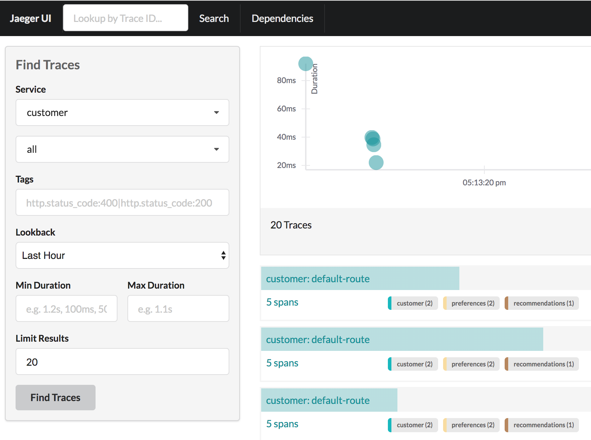

Tracing requires a bit of work on the Java side. Each microservice needs to pass on the headers which are used to enable the traces.

Look at `istio-tutorial/customer/src/main/java/com/redhat/developer/demos/customer/tracing/HttpHeaderForwarderHandlerInterceptor.java`{{open}}

and 

`istio-tutorial/customer/src/main/java/com/redhat/developer/demos/customer/CustomerApplication.java`{{open}} on lines 21 to 31.

## Install Jaeger console

Jaeger allow you to trace the invocation.

Install Jaeger console by executing: `oc process -f https://raw.githubusercontent.com/jaegertracing/jaeger-openshift/master/all-in-one/jaeger-all-in-one-template.yml | oc create -n istio-system -f -`{{execute}}

Execute `oc get pods -w -n istio-system`{{execute}} and wait until `jaeger` pod READY column is 1/1.

Hit `CTRL+C` and run several requests through the system: `curl http://customer-tutorial.[[HOST_SUBDOMAIN]]-80-[[KATACODA_HOST]].environments.katacoda.com`{{execute}}

Check `Jaeger` route by typing `oc get routes -n istio-system`{{execute}}

Now that you know the URL of `Jaeger`, access it at  

https://jaeger-query-istio-system.[[HOST_SUBDOMAIN]]-80-[[KATACODA_HOST]].environments.katacoda.com 

Select `customer` from the list of services and click on `Find Traces`

